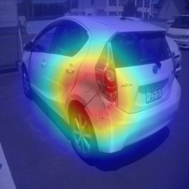
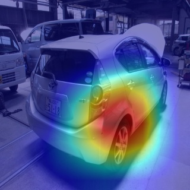
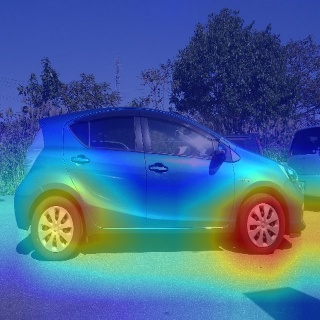

|0|1|2|3|
|---|---|---|---|
||||

|4|5|6|7|
|---|---|---|---|
||||

## Usage

1. model_saveにbest.pthを置く
2. `python grad_cam.py --image-dir <実行したい画像があるディレクトリ>`

## VGG以外の任意のネットワークでGrad_camを適応する方法
例として[Resnext](https://github.com/pytorch/vision/blob/master/torchvision/models/resnet.py)で学習させたものからヒートマップを作る.
必要モジュールのインポートとモデルの読み込み
```.py
import torch.nn as nn
import torch.nn.functional as F
import torchvision.transforms as transforms
from PIL import Image
import matplotlib.pyplot as plt
import numpy as np
import cv2

from resnext.resnext import resnext101_32x8d
model = resnext101_32x8d(pretrained=1)
```


ネットワークから全結合層の一つ前の層(feature_extractor)と分類層(classifier)を取り出す
```.py
feature_extractor = nn.Sequential(model.conv1, model.bn1, model.relu, model.maxpool, model.layer1, model.layer2, model.layer3, model.layer4)      

classifier = nn.Sequential(model.fc)
```
注目箇所をヒートマップに変換する関数
```py
def toHeatmap(x):
    x = (x*255).reshape(-1)
    cm = plt.get_cmap('jet')
    x = np.array([cm(int(np.round(xi)))[:3] for xi in x])
    return x.reshape(224,224,3)
```
ヒートマップを作る画像の取り込み(テンソル化と正規化)
```py
img = Image.open('./resnext/cat.jpg')
preprocess = transforms.Compose([transforms.Resize((224,224)),transforms.ToTensor(), transforms.Normalize(mean=[0.485, 0.456, 0.406], std=[0.229, 0.224, 0.225]),])
img_tensor = preprocess(img)
# GPUで学習している場合
# img_tensor = preprocess(img).to('cuda')
```
ここからの注目度を計算するコードはネットワーク毎に異なるので計算式を参考にする。

$A_{ij}^k$ : 得られた特徴マップのkチャネル、(i,j)ピクセルを意味する。

$y^c$ : 予測されたcクラスの出力

特徴マップの各チャネルの重みを計算

$a_k^c=\frac{1}{Z}\sum_i \sum_j \frac{δy^c}{δA_{ij}^k}$

この各チャネルの重みを使って注目度を次のように算出

$L_{grad-cam}^c=ReLU(\sum_ka_k^cA^k)$
```py
feature = feature_extractor(img_tensor.view(-1,3,224,224)) #特徴マップを計算
feature = feature.clone().detach().requires_grad_(True) #勾配を計算するようにコピー
y_pred = classifier(model.avgpool(feature).view(-1,2048))
y_pred[0][torch.argmax(y_pred)].backward() # 予測でもっとも高い値をとったクラスの勾配を計算

# 以下は上記の式に倣って計算しています
alpha = torch.mean(feature.grad.view(2048,7*7),1)
feature = feature.view(2048,7,7)
L = F.relu(torch.sum(feature*alpha.view(-1,1,1),0)).cpu().detach().numpy()

# (0,1)になるように正規化
L_min = np.min(L)
L_max = np.max(L - L_min)
L = (L - L_min)/L_max
# 得られた注目度をヒートマップに変換
L = toHeatmap(cv2.resize(L,(224,224)))
```
ヒートマップの出力
```py
# 画像の正規化を戻すのに利用します
mean = torch.tensor([0.485, 0.456, 0.406]).view(3,1,1)
std = torch.tensor([0.229, 0.224, 0.225]).view(3,1,1)
img_tensor = preprocess(img)
img1 = (img_tensor*std + mean).permute(1,2,0).cpu().detach().numpy()
img2 = L

alpha = 0.3
blended = img1*alpha + img2*(1-alpha)
# 結果を表示する。
plt.figure(figsize=(8,8))
plt.imshow(blended)
plt.axis('off')
plt.show()
```
